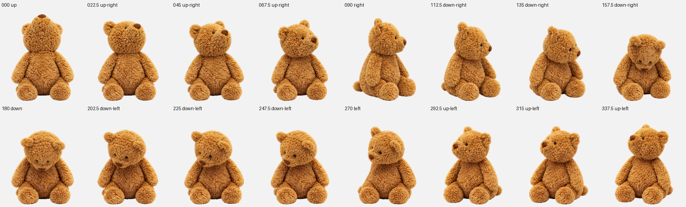

# Bartholomew Bear for Codex

一只以 Jellycat Bartholomew Bear（巴塞罗熊）为视觉参考制作的 Codex 桌宠。



## 功能

- Codex 桌宠图集 v2
- 8 × 11、1536 × 2288 RGBA WebP 图集
- 9 组状态动作：待机、左右移动、挥手、跳跃、失败、等待、运行和检查
- 16 个鼠标注视方向
- Windows 安装方式

## 安装

1. 下载本仓库中的 `pet.json` 和 `spritesheet.webp`。
2. 在 Windows 中创建目录：

   ```text
   %USERPROFILE%\.codex\pets\bartholomew-bear
   ```

3. 将两个文件复制进去，最终结构应为：

   ```text
   %USERPROFILE%\.codex\pets\bartholomew-bear\
   ├── pet.json
   └── spritesheet.webp
   ```

4. 完全退出并重新打开 Codex。
5. 在 Codex 的桌宠列表中选择 **Bartholomew Bear**。如果当前版本自动启用新安装的自定义桌宠，则重启后会直接显示。

## PowerShell 快速安装

在已下载本仓库文件的目录中运行：

```powershell
$petDir = Join-Path $env:USERPROFILE '.codex\pets\bartholomew-bear'
New-Item -ItemType Directory -Force -Path $petDir | Out-Null
Copy-Item -LiteralPath '.\pet.json' -Destination (Join-Path $petDir 'pet.json') -Force
Copy-Item -LiteralPath '.\spritesheet.webp' -Destination (Join-Path $petDir 'spritesheet.webp') -Force
```

## 卸载

退出 Codex 后，删除以下目录并重新打开 Codex：

```text
%USERPROFILE%\.codex\pets\bartholomew-bear
```

## 文件说明

- `pet.json`：桌宠清单，使用 `spriteVersionNumber: 2`
- `spritesheet.webp`：透明背景的动画图集
- `preview.png`：动作与 16 个注视方向预览

## 声明

这是非官方、非商业用途的粉丝创作，与 Jellycat 或 OpenAI 无隶属或背书关系。Bartholomew Bear、Jellycat、Codex 及相关名称和形象权利归各自权利人所有。

